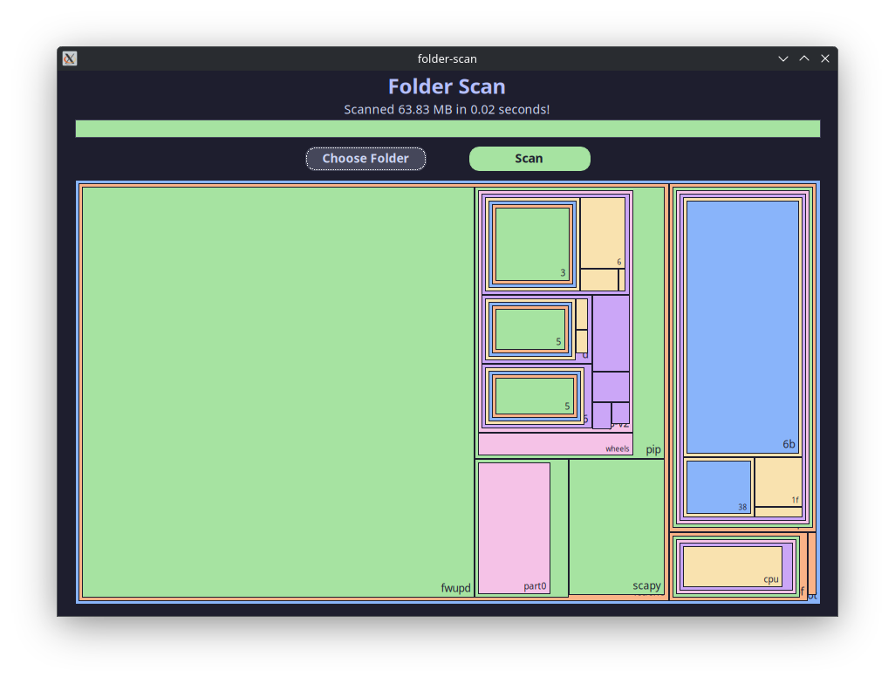

# folder-scan

Simple, lightweigth and blazingly fast folder scanner with a tree-like visualization that can be used to find space hogs.

---

## Benchmarks

> All tests were done using Arch Linux and may differ on Windows

The idle memory usage on startup is about 11 MB.

The program was able to scan a 178 GB folder in around 7 seconds (4 for a rescan) while using only ~33 MB of RAM.
